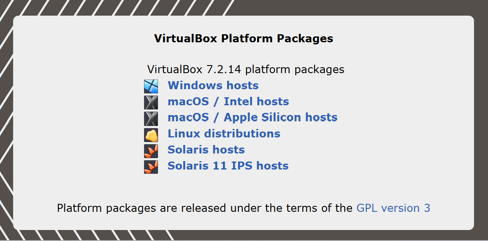

# 🚀 Panduan Lab Keamanan Siber: VirtualBox, Kali Linux & Metasploitable 2

Repositori ini berisi panduan dasar dan instruksi langkah demi langkah untuk membangun laboratorium keamanan siber lokal menggunakan teknologi virtualisasi.

---

## 📌 Daftar Isi
1. [Pengenalan Komponen](#-pengenalan-komponen)
   - [VirtualBox](#1-oracle-virtualbox)
   - [Kali Linux](#2-kali-linux)
   - [Metasploitable 2](#3-metasploitable-2)
2. [Analogi Sederhana](#-analogi-sederhana-penyerang-vs-korban)
3. [Panduan Instalasi VirtualBox](#-panduan-instalasi-virtualbox)
4. [Panduan Instalasi Kali Linux](#-panduan-instalasi-kali-linux)
   - [Opsi A: Menggunakan Installer Images (Instalasi Manual)](#opsi-a-menggunakan-installer-images-instalasi-manual)
   - [Opsi B: Menggunakan Pre-built Virtual Machines (Sangat Direkomendasikan)](#opsi-b-menggunakan-pre-built-virtual-machines-sangat-direkomendasikan)
5. [Panduan Instalasi Metasploitable 2](#-panduan-instalasi-metasploitable-2)
6. [⚠️ Konfigurasi Jaringan & Peringatan Keamanan](#%EF%B8%8F-konfigurasi-jaringan--peringatan-keamanan)

---

## 🔍 Pengenalan Komponen

### 1. Oracle VirtualBox
**Oracle VirtualBox** adalah perangkat lunak virtualisasi gratis dan sumber terbuka (*open-source*). Aplikasi ini memungkinkan Anda untuk menjalankan sistem operasi lain di dalam sistem operasi utama Anda tanpa perlu melakukan *restart* atau mengubah partisi *harddisk*.

* **Fungsi Utama:** Membuat *Virtual Machine* (VM) atau mesin virtual.
* **Cara Kerja:** Mengambil sebagian kapasitas RAM, CPU, dan penyimpanan dari komputer fisik untuk dialokasikan ke komputer virtual.
* **Keuntungan:** Sangat aman untuk uji coba perangkat lunak dan belajar sistem operasi baru. Jika sistem virtual terkena virus, komputer utama Anda tetap aman (*sandbox*).

### 2. Kali Linux
**Kali Linux** adalah distribusi (distro) sistem operasi Linux berbasis Debian yang dikembangkan khusus untuk kebutuhan audit keamanan, forensik digital, dan *ethical hacking* (peretasan etis).

* **Fungsi Utama:** Melakukan pengujian celah keamanan pada jaringan, aplikasi, atau sistem komputer.
* **Fitur Unggulan:** Sudah dilengkapi dengan ratusan alat (*tools*) peretasan siap pakai seperti Nmap, Wireshark, dan Metasploit.
* **Pengguna:** Pakar keamanan siber, analis forensik digital, mahasiswa IT, hingga peretas topi putih (*white hat hackers*).

### 3. Metasploitable 2
**Metasploitable 2** adalah sistem operasi Linux virtual yang sengaja dibuat sangat rapuh, penuh celah keamanan (*vulnerabilities*), dan mudah diretas. Sistem ini dikembangkan oleh Rapid7 khusus sebagai sasaran atau target latihan.

* **Legalitas:** Memberikan target nyata yang 100% legal untuk diserang tanpa melanggar hukum.
* **Kaya Celah Keamanan Asli:** Berisi banyak layanan jaringan versi lama (seperti FTP, HTTP, database) yang memiliki *bug* fatal dan belum ditambal.
* **Ringan:** Berbasis teks tanpa tampilan grafis (GUI), sehingga hanya membutuhkan RAM kecil sekitar 512 MB hingga 1 GB.

---

## 🎭 Analogi Sederhana: Penyerang vs Korban

Jika Anda sedang membangun laboratorium keamanan siber di VirtualBox:
* **Kali Linux** berperan sebagai **Petarung/Penyerang** yang membawa ratusan senjata dan alat peretas.
* **Metasploitable 2** berperan sebagai **Samsat/Korban** yang diam dan menerima serangan untuk menguji seberapa hebat senjata Anda.

---

## 💻 Panduan Instalasi VirtualBox

Unduh file *installer* resmi melalui tautan berikut: 🔗 [VirtualBox Downloads](https://www.virtualbox.org/wiki/Downloads)

### Langkah 1: Pilih Paket yang Sesuai dengan OS Anda
* **Windows hosts:** Untuk pengguna Windows 10 atau Windows 11.
* **macOS / Intel hosts:** Untuk MacBook/iMac lama yang memakai prosesor Intel.
* **macOS / Apple Silicon hosts:** Untuk MacBook/iMac baru yang memakai chip Apple (M1, M2, M3, M4, dst.).
* **Linux distributions:** Untuk pengguna Ubuntu, Debian, Fedora, atau distro Linux lainnya.
* **Solaris hosts / Solaris 11 IPS hosts:** Pilihan khusus untuk pengguna OS Oracle Solaris.

### Langkah 2: Proses Mengunduh File
Setelah memilih opsi yang sesuai, file installer (berformat `.exe` untuk Windows atau `.dmg` untuk Mac) akan terunduh otomatis. Tunggu hingga proses unduhan selesai 100%.

### Langkah 3: Langkah Instalasi (Contoh pada Windows)
1. **Buka File Installer:** Klik dua kali pada file unduhan bernama `VirtualBox-7.2.14-...-Win.exe`.
2. **Izinkan Akses:** Jika muncul jendela *User Account Control* (UAC), klik **Yes**.
3. **Ikuti Wizard:** Klik **Next** pada jendela selamat datang.
4. **Pilih Komponen:** Biarkan pengaturan komponen bawaan (*default*), lalu klik **Next**.
5. **Peringatan Jaringan:** Installer akan memunculkan peringatan bahwa koneksi internet akan terputus sesaat selama proses instalasi kartu jaringan virtual. Klik **Yes**.
6. **Mulai Instal:** Klik **Install** dan tunggu hingga bilah proses selesai.
7. **Selesai:** Klik **Finish**. Aplikasi VirtualBox akan otomatis terbuka dan siap digunakan.

---

## 🐉 Panduan Instalasi Kali Linux

Terdapat dua metode untuk memasang Kali Linux di VirtualBox. Pilih salah satu metode di bawah ini:

### Opsi A: Menggunakan Installer Images (Instalasi Manual)
Metode ini digunakan jika Anda ingin mengonfigurasi dan melakukan proses instalasi sistem operasi secara mandiri dari awal.

* **Tautan Unduhan:** 🔗 [Kali Installer Images](https://www.kali.org/get-kali/#kali-installer-images)

1. **Tentukan Arsitektur Prosesor:** Sebelum mengunduh, pastikan pilihan arsitektur di bagian atas halaman web sudah sesuai dengan komputer fisik (*host*) Anda:
   - **`x86_64`:** Pilih ini jika komputer Anda menggunakan prosesor Intel atau AMD (Mayoritas Windows & Mac lama).
   - **`Apple Silicon (ARM64)`:** Klik opsi ini terlebih dahulu jika Anda menggunakan Mac baru dengan chip M1, M2, M3, M4, dll.
2. **Pilih Jenis Installer:** Carilah varian yang berlabel **Recommended**.
   - **Installer (Sangat Direkomendasikan):** Berisi paket lengkap (~4.4 GB) untuk instalasi luring (*offline*) sehingga tidak memerlukan koneksi internet cepat saat proses instalasi di dalam VirtualBox. Klik ikon panah bawah untuk mengunduh langsung.
   - **Varian Lain (Opsional):** *Weekly* (citra mingguan terbaru belum diuji), *NetInstaller* (memerlukan internet kencang saat instalasi), atau *Everything* (paket super lengkap untuk jaringan terisolasi/*air-gapped*).

### Opsi B: Menggunakan Pre-built Virtual Machines (Sangat Direkomendasikan)
Metode ini jauh lebih cepat karena menyediakan mesin virtual yang sudah jadi, sehingga Anda tidak perlu melakukan proses instalasi dari awal.

* **Tautan Unduhan:** 🔗 [Kali Virtual Machines](https://www.kali.org/get-kali/#kali-virtual-machines)

1. **Unduh File yang Tepat:** Pada halaman web, fokus pada kotak berlogo **VirtualBox**. Klik ikon panah bawah untuk mengunduh file kompresi siap pakai (~3.6 GB).
2. **Ekstrak File:** Setelah selesai diunduh, ekstrak file kompresi (`.7z` atau `.zip`) menggunakan aplikasi seperti **7-Zip** atau **WinRAR** ke sebuah folder khusus di komputer Anda.
3. **Tambahkan ke VirtualBox:**
   - Jalankan aplikasi Oracle VirtualBox.
   - Klik menu **Machine** di bagian atas, lalu pilih **Add** (atau tekan pintasan `Ctrl + A`).
   - Cari folder tempat Anda mengekstrak file tadi, pilih file konfigurasi mesin virtual berformat `.vbox`, lalu klik **Open**.
4. **Jalankan Mesin:** Kali Linux akan otomatis muncul di daftar mesin virtual. Klik dua kali nama mesin tersebut atau klik tombol **Start** (panah hijau).
5. **Akses Masuk:** Saat sistem memuat layar masuk, gunakan kredensial bawaan berikut:
   - **Username:** `kali`
   - **Password:** `kali`

---

## 🎯 Panduan Instalasi Metasploitable 2

Metasploitable 2 didistribusikan dalam bentuk *Virtual Hard Disk* yang sudah jadi (berformat `.vmdk`), sehingga Anda tidak perlu melakukan proses penginstalan sistem operasi dari awal.

* **Tautan Unduhan:** 🔗 [Metasploitable 2 Download](https://sourceforge.net/projects/metasploitable2/)

### Langkah 1: Proses Mengunduh File
1. Klik tombol besar berwarna hijau bertuliskan **Download** pada situs SourceForge.
2. Halaman akan menghitung mundur beberapa detik sebelum berkas mulai terunduh secara otomatis.
3. File yang terunduh berupa file arsip kompresi berformat `.zip` dengan ukuran sekitar 800 MB hingga 1 GB.

### Langkah 2: Langkah Pemasangan di VirtualBox
1. **Ekstrak File ZIP:** Klik kanan pada berkas `.zip` yang sudah terunduh, lalu ekstrak menggunakan WinRAR atau 7-Zip ke folder khusus. Pastikan Anda melihat file bernama `Metasploitable.vmdk` di dalamnya.
2. **Buat Mesin Virtual Baru:**
   - Buka aplikasi VirtualBox.
   - Klik tombol **New** (ikon lingkaran biru bergerigi).
   - **Nama:** Isi dengan `Metasploitable 2`.
   - **Type:** Pilih `Linux`.
   - **Version:** Pilih `Ubuntu (64-bit)` atau `Linux 2.6 / 3.x / 4.x (64-bit)`. Klik **Next**.
3. **Atur RAM (Hardware):** Alokasikan RAM sebesar `512 MB` atau `1024 MB` (1 GB). Mesin ini sangat ringan karena berbasis teks. Klik **Next**.
4. **Gunakan Hard Disk yang Sudah Ada (Paling Penting!):**
   - Pada bagian pengaturan Virtual Hard disk, jangan pilih *Create a Virtual Hard Disk Now*.
   - Pilih opsi **Use an Existing Virtual Hard Disk File**.
   - Klik ikon folder di sebelah kanan bawah, klik tombol **Add**, lalu cari dan pilih file `Metasploitable.vmdk` yang telah Anda ekstrak di awal tadi.
   - Klik **Choose**, lalu selesaikan wizard dengan mengeklik **Next** dan **Finish**.
5. **Jalankan Mesin:** Klik nama mesin `Metasploitable 2` di daftar VirtualBox, lalu klik **Start**. 
6. **Akses Masuk:** Saat layar hitam meminta login, gunakan kredensial bawaan berikut:
   - **Username:** `msfadmin`
   - **Password:** `msfadmin`

---

## ⚠️ Konfigurasi Jaringan & Peringatan Keamanan

> [!CAUTION]
> Karena Metasploitable 2 sengaja dibuat penuh celah keamanan, jangan pernah menghubungkan mesin ini ke jaringan internet publik atau Wi-Fi terbuka. Jika terhubung ke luar, komputer virtual tersebut bisa dengan mudah dieksploitasi oleh orang asing di internet.

### 🌐 Pengaturan Jaringan Laboratorium yang Aman

Agar laboratorium Anda aman dan mesin Kali Linux tetap bisa terhubung untuk menyerang Metasploitable 2, ubah pengaturan kartu jaringannya sebelum mesin dinyalakan:

1. **Buka Menu Pengaturan:**  
   Klik kanan pada mesin **Metasploitable 2** di daftar VirtualBox, lalu pilih **Settings**.
   
2. **Pilih Menu Jaringan:**  
   Masuk ke menu **Network** di panel sebelah kiri.
   
3. **Ubah Mode Adaptor:**  
   Pada opsi **Attached to**, ubah pilihan menjadi **Host-only Adapter** atau **NAT Network**.

> [!IMPORTANT]
> ❌ **Jangan memilih Bridged Adapter** agar mesin yang rapuh ini tidak mendapatkan akses langsung ke jaringan lokal fisik atau Wi-Fi rumah Anda.
